# ⚙️ Technical Reference Gameplan

This is your detailed technical reference. Use this when you need specific implementation details, code snippets, or troubleshooting help.

---

## 🎯 Phase 1: Setup & Foundation (2-3 hours)

### Goal
Get the skeleton running with all services initialized.

### Monorepo Structure
```
redis-puml-miniapp/
├── apps/
│   ├── reviewer/              # Vite + React + TypeScript
│   └── participant/           # Vite + React + TypeScript
├── services/
│   └── server/                # Fastify + Socket.IO + Redis
├── packages/
│   └── shared/                # Shared TypeScript types
├── docs/
│   └── architecture.puml      # System diagram
├── docker-compose.yml         # Redis container
├── pnpm-workspace.yaml        # Workspace config
├── package.json               # Root package.json
└── .gitignore
```

### Workspace Setup (pnpm)

Create `pnpm-workspace.yaml`:
```yaml
packages:
  - 'apps/*'
  - 'services/*'
  - 'packages/*'
```

Root `package.json`:
```json
{
  "name": "redis-puml-miniapp",
  "private": true,
  "scripts": {
    "dev": "concurrently \"pnpm -C services/server dev\" \"pnpm -C apps/reviewer dev\" \"pnpm -C apps/participant dev\"",
    "server": "pnpm -C services/server dev",
    "reviewer": "pnpm -C apps/reviewer dev",
    "participant": "pnpm -C apps/participant dev"
  },
  "devDependencies": {
    "concurrently": "^8.2.2"
  }
}
```

### Docker Compose for Redis

`docker-compose.yml`:
```yaml
version: '3.8'

services:
  redis:
    image: redis:7-alpine
    container_name: redis-puml-miniapp
    ports:
      - "6379:6379"
    volumes:
      - redis-data:/data
    command: redis-server --appendonly yes

volumes:
  redis-data:
```

Start: `docker-compose up -d`
Stop: `docker-compose down`

### Shared Types Package

`/packages/shared/package.json`:
```json
{
  "name": "shared",
  "version": "1.0.0",
  "main": "./src/index.ts",
  "types": "./src/index.ts",
  "exports": {
    ".": "./src/index.ts"
  }
}
```

`/packages/shared/src/types.ts`:
```typescript
export type FollowUpPayload = {
  items: string[];
  createdAt: number;
};

export type AgentQuestions = {
  text: string;
  createdAt: number;
  streamId?: string;
};

export interface ClientToServerEvents {
  "followup:create": (payload: FollowUpPayload) => void;
  "request:replay": (lastStreamId: string | null) => void;
}

export interface ServerToClientEvents {
  "agent:questions": (data: AgentQuestions) => void;
}
```

`/packages/shared/src/index.ts`:
```typescript
export * from './types';
```

---

## 🔧 Phase 2: Backend Core (4-5 hours)

### Goal
Get WebSocket + Redis + OpenAI working end-to-end.

### Dependencies

```bash
cd services/server
pnpm install fastify @fastify/websocket fastify-socket.io socket.io redis openai dotenv
pnpm install -D typescript @types/node tsx
```

### Environment Configuration

`.env`:
```env
OPENAI_API_KEY=sk-...
REDIS_URL=redis://localhost:6379
NODE_ENV=development
PORT=3000
```

`.env.example`:
```env
OPENAI_API_KEY=your-openai-api-key
REDIS_URL=redis://localhost:6379
NODE_ENV=development
PORT=3000
```

### Server Implementation

`/services/server/server.ts`:
```typescript
import Fastify from 'fastify';
import fastifySocketIO from 'fastify-socket.io';
import { createClient } from 'redis';
import OpenAI from 'openai';
import 'dotenv/config';
import type { 
  ClientToServerEvents, 
  ServerToClientEvents,
  FollowUpPayload,
  AgentQuestions 
} from 'shared';

const app = Fastify({ logger: true });

// Redis client
const redis = createClient({
  url: process.env.REDIS_URL || 'redis://localhost:6379'
});

redis.on('error', (err) => console.error('❌ Redis error:', err));
redis.on('connect', () => console.log('✅ Redis connected'));

await redis.connect();

// OpenAI client
const openai = new OpenAI({
  apiKey: process.env.OPENAI_API_KEY
});

// Register Socket.IO
await app.register(fastifySocketIO, {
  cors: {
    origin: ['http://localhost:5173', 'http://localhost:5174'],
    credentials: true
  }
});

// Health endpoint
app.get('/health', async () => {
  return { ok: true, redis: redis.isOpen };
});

// WebSocket connection handling
app.ready().then(() => {
  app.io.on('connection', (socket) => {
    console.log('✅ Client connected:', socket.id);

    // Handle follow-up creation
    socket.on('followup:create', async (data: FollowUpPayload) => {
      try {
        console.log('📨 Received followup:', data);

        // Validate
        if (!data.items || data.items.length === 0) {
          console.error('❌ Empty items');
          return;
        }

        if (data.items.length > 8) {
          console.error('❌ Too many items');
          return;
        }

        const totalChars = data.items.join('').length;
        if (totalChars > 300) {
          console.error('❌ Too many characters');
          return;
        }

        // Store in Redis Stream
        await redis.xAdd('followups:stream', '*', {
          items: JSON.stringify(data.items),
          createdAt: data.createdAt.toString(),
          socketId: socket.id
        });

        // Call OpenAI
        const response = await openai.chat.completions.create({
          model: 'gpt-4o-mini',
          messages: [{
            role: 'system',
            content: 'You are a helpful assistant. Turn the following list of items into 2-4 concise, polite clarifying questions. Start with "Sorry to circle back — could you help me clarify" and then list the items as questions.'
          }, {
            role: 'user',
            content: `Items: ${data.items.join(', ')}`
          }],
          max_tokens: 150,
          temperature: 0.7
        });

        const aiText = response.choices[0].message.content || 'No response';
        
        // Store in Redis Stream
        const streamId = await redis.xAdd('questions:stream', '*', {
          text: aiText,
          createdAt: Date.now().toString()
        });

        // Publish to Pub/Sub
        await redis.publish('questions:live', JSON.stringify({
          text: aiText,
          createdAt: Date.now(),
          streamId
        }));

        // Broadcast to all clients
        const questionData: AgentQuestions = {
          text: aiText,
          createdAt: Date.now(),
          streamId
        };

        console.log('📤 Broadcasting:', questionData);
        app.io.emit('agent:questions', questionData);

      } catch (error) {
        console.error('❌ Error processing followup:', error);
        socket.emit('agent:questions', {
          text: 'Sorry, I encountered an error generating questions.',
          createdAt: Date.now()
        });
      }
    });

    // Handle replay requests
    socket.on('request:replay', async (lastStreamId: string | null) => {
      try {
        console.log('🔄 Replay requested from:', lastStreamId || '0');

        const messages = await redis.xRead(
          { key: 'questions:stream', id: lastStreamId || '0' },
          { COUNT: 100 }
        );

        if (messages && messages.length > 0) {
          for (const message of messages[0].messages) {
            const data = message.message;
            socket.emit('agent:questions', {
              text: data.text,
              createdAt: parseInt(data.createdAt),
              streamId: message.id
            });
          }
          console.log(`📦 Replayed ${messages[0].messages.length} messages`);
        } else {
          console.log('📦 No messages to replay');
        }
      } catch (error) {
        console.error('❌ Replay error:', error);
      }
    });

    socket.on('disconnect', () => {
      console.log('❌ Client disconnected:', socket.id);
    });
  });
});

// Start server
const start = async () => {
  try {
    await app.listen({ 
      port: parseInt(process.env.PORT || '3000'),
      host: '0.0.0.0' 
    });
    console.log('✅ Server running on http://localhost:3000');
  } catch (err) {
    app.log.error(err);
    await redis.quit();
    process.exit(1);
  }
};

start();
```

`package.json` scripts:
```json
{
  "scripts": {
    "dev": "tsx watch server.ts",
    "build": "tsc",
    "start": "node dist/server.js"
  }
}
```

### Rate Limiting & Deduplication

Add to server after validation:
```typescript
// Rate limiting (simple counter)
const rateLimitKey = `rate:${socket.id}`;
const count = await redis.incr(rateLimitKey);
await redis.expire(rateLimitKey, 60); // 1 minute window

if (count > 10) {
  console.error('❌ Rate limit exceeded');
  return;
}

// Deduplication (hash of items)
const itemsHash = Buffer.from(JSON.stringify(data.items)).toString('base64');
const dedupKey = `dedup:${itemsHash}`;
const exists = await redis.get(dedupKey);

if (exists) {
  console.error('❌ Duplicate request');
  return;
}

await redis.set(dedupKey, '1', { EX: 300 }); // 5 minute TTL
```

---

## 🎨 Phase 3: Frontend A - Reviewer (2-3 hours)

### Setup

```bash
cd apps/reviewer
pnpm create vite@latest . --template react-ts
pnpm install socket.io-client
```

### Implementation

`/apps/reviewer/src/App.tsx`:
```typescript
import { useState, useEffect } from 'react';
import { io, Socket } from 'socket.io-client';
import type { ClientToServerEvents, ServerToClientEvents } from 'shared';

const socket: Socket<ServerToClientEvents, ClientToServerEvents> = io('http://localhost:3000');

type Status = 'disconnected' | 'connected' | 'sending' | 'sent' | 'error';

function App() {
  const [input, setInput] = useState('');
  const [status, setStatus] = useState<Status>('disconnected');

  useEffect(() => {
    socket.on('connect', () => {
      console.log('✅ Connected to server');
      setStatus('connected');
    });

    socket.on('disconnect', () => {
      console.log('❌ Disconnected from server');
      setStatus('disconnected');
    });

    return () => {
      socket.off('connect');
      socket.off('disconnect');
    };
  }, []);

  const handleSend = () => {
    if (!input.trim()) return;

    const items = input
      .split(',')
      .map(item => item.trim())
      .filter(item => item !== '');

    if (items.length === 0) {
      setStatus('error');
      return;
    }

    if (items.length > 8) {
      alert('Maximum 8 items allowed');
      return;
    }

    const totalChars = items.join('').length;
    if (totalChars > 300) {
      alert('Total character limit (300) exceeded');
      return;
    }

    setStatus('sending');
    
    socket.emit('followup:create', {
      items,
      createdAt: Date.now()
    });

    setTimeout(() => {
      setStatus('sent');
      setInput('');
    }, 500);
  };

  const getStatusColor = () => {
    switch (status) {
      case 'connected': return '#4CAF50';
      case 'sending': return '#FF9800';
      case 'sent': return '#2196F3';
      case 'error': return '#F44336';
      default: return '#9E9E9E';
    }
  };

  return (
    <div style={{ 
      padding: '40px', 
      maxWidth: '600px', 
      margin: '0 auto',
      fontFamily: 'system-ui, sans-serif'
    }}>
      <h1>Reviewer</h1>
      <div style={{ 
        marginBottom: '20px',
        padding: '10px',
        background: getStatusColor(),
        color: 'white',
        borderRadius: '4px'
      }}>
        Status: {status}
      </div>

      <div style={{ marginBottom: '20px' }}>
        <input
          type="text"
          value={input}
          onChange={(e) => setInput(e.target.value)}
          onKeyPress={(e) => e.key === 'Enter' && handleSend()}
          placeholder="Enter items separated by commas"
          disabled={status === 'disconnected'}
          style={{
            width: '100%',
            padding: '12px',
            fontSize: '16px',
            border: '2px solid #ddd',
            borderRadius: '4px',
            boxSizing: 'border-box'
          }}
        />
        <small style={{ color: '#666' }}>
          Example: latency, retry logic, error states
        </small>
      </div>

      <button
        onClick={handleSend}
        disabled={status === 'disconnected' || !input.trim()}
        style={{
          width: '100%',
          padding: '12px',
          fontSize: '16px',
          background: '#2196F3',
          color: 'white',
          border: 'none',
          borderRadius: '4px',
          cursor: status === 'disconnected' ? 'not-allowed' : 'pointer',
          opacity: status === 'disconnected' ? 0.5 : 1
        }}
      >
        Send
      </button>
    </div>
  );
}

export default App;
```

### Link Shared Types

`package.json`:
```json
{
  "dependencies": {
    "shared": "workspace:*",
    "socket.io-client": "^4.7.2"
  }
}
```

---

## 🎧 Phase 4: Frontend B - Participant (2-3 hours)

### Setup

```bash
cd apps/participant
pnpm create vite@latest . --template react-ts
pnpm install socket.io-client
```

Edit `vite.config.ts`:
```typescript
import { defineConfig } from 'vite'
import react from '@vitejs/plugin-react'

export default defineConfig({
  plugins: [react()],
  server: {
    port: 5174
  }
})
```

### Implementation

`/apps/participant/src/App.tsx`:
```typescript
import { useState, useEffect, useRef } from 'react';
import { io, Socket } from 'socket.io-client';
import type { ClientToServerEvents, ServerToClientEvents, AgentQuestions } from 'shared';

const socket: Socket<ServerToClientEvents, ClientToServerEvents> = io('http://localhost:3000');

type Status = 'disconnected' | 'ready' | 'speaking';

function App() {
  const [status, setStatus] = useState<Status>('disconnected');
  const [messages, setMessages] = useState<AgentQuestions[]>([]);
  const lastStreamId = useRef<string | null>(null);
  const speakQueue = useRef<string[]>([]);
  const isSpeaking = useRef(false);

  const speak = (text: string) => {
    speakQueue.current.push(text);
    processQueue();
  };

  const processQueue = () => {
    if (isSpeaking.current || speakQueue.current.length === 0) return;

    isSpeaking.current = true;
    setStatus('speaking');
    
    const text = speakQueue.current.shift()!;
    const utterance = new SpeechSynthesisUtterance(text);
    
    utterance.onend = () => {
      isSpeaking.current = false;
      if (speakQueue.current.length === 0) {
        setStatus('ready');
      }
      processQueue();
    };

    utterance.onerror = () => {
      isSpeaking.current = false;
      setStatus('ready');
      processQueue();
    };

    window.speechSynthesis.speak(utterance);
  };

  useEffect(() => {
    socket.on('connect', () => {
      console.log('✅ Connected to server');
      setStatus('ready');
      
      // Request replay
      socket.emit('request:replay', lastStreamId.current);
    });

    socket.on('disconnect', () => {
      console.log('❌ Disconnected from server');
      setStatus('disconnected');
    });

    socket.on('agent:questions', (data: AgentQuestions) => {
      console.log('📩 Received question:', data);
      setMessages(prev => [...prev, data]);
      speak(data.text);
      
      if (data.streamId) {
        lastStreamId.current = data.streamId;
      }
    });

    return () => {
      socket.off('connect');
      socket.off('disconnect');
      socket.off('agent:questions');
      window.speechSynthesis.cancel();
    };
  }, []);

  const getStatusColor = () => {
    switch (status) {
      case 'ready': return '#4CAF50';
      case 'speaking': return '#2196F3';
      default: return '#9E9E9E';
    }
  };

  return (
    <div style={{ 
      padding: '40px',
      maxWidth: '600px',
      margin: '0 auto',
      fontFamily: 'system-ui, sans-serif'
    }}>
      <h1>Participant</h1>
      <div style={{
        marginBottom: '20px',
        padding: '10px',
        background: getStatusColor(),
        color: 'white',
        borderRadius: '4px'
      }}>
        Status: {status}
      </div>

      <div style={{
        border: '2px solid #ddd',
        borderRadius: '4px',
        padding: '20px',
        minHeight: '400px',
        maxHeight: '400px',
        overflowY: 'auto',
        background: '#fafafa'
      }}>
        <h3 style={{ marginTop: 0 }}>Questions:</h3>
        {messages.length === 0 ? (
          <p style={{ color: '#999' }}>Waiting for questions...</p>
        ) : (
          messages.map((msg, idx) => (
            <div
              key={idx}
              style={{
                padding: '12px',
                margin: '10px 0',
                background: 'white',
                borderRadius: '4px',
                boxShadow: '0 1px 3px rgba(0,0,0,0.1)'
              }}
            >
              <div style={{ marginBottom: '8px' }}>{msg.text}</div>
              <small style={{ color: '#666' }}>
                {new Date(msg.createdAt).toLocaleTimeString()}
              </small>
            </div>
          ))
        )}
      </div>
    </div>
  );
}

export default App;
```

---

## 📊 Phase 7: PlantUML Diagram (1 hour)

`/docs/architecture.puml`:

```plantuml
@startuml

title Redis + PUML Mini-Project - System Architecture

!define ACCENT_COLOR #2196F3
!define SUCCESS_COLOR #4CAF50
!define WARNING_COLOR #FF9800

actor Reviewer as reviewer
actor Participant as participant

box "Frontend Applications" ACCENT_COLOR
  participant "Reviewer App\n(React + TS)\nPort 5173" as ReviewerApp
  participant "Participant App\n(React + TS)\nPort 5174" as ParticipantApp
end box

box "Backend Services" SUCCESS_COLOR
  participant "Fastify Server\n(Node.js + Socket.IO)\nPort 3000" as Server
  participant "OpenAI API\n(gpt-4o-mini)" as OpenAI
end box

box "Data Layer" WARNING_COLOR
  database "Redis Streams\n• followups:stream\n• questions:stream" as Streams
  database "Redis Pub/Sub\n• questions:live" as PubSub
end box

== Initial Connection ==

ReviewerApp -> Server: WebSocket connect
Server -> ReviewerApp: Connected

ParticipantApp -> Server: WebSocket connect
Server -> ParticipantApp: Connected
ParticipantApp -> Server: request:replay(null)
Server -> Streams: XREAD from 0
Streams --> Server: Historical messages
Server -> ParticipantApp: agent:questions (replay)

== Message Flow ==

reviewer -> ReviewerApp: Speak/Type:\n"latency, retry logic,\nerror states"

ReviewerApp -> ReviewerApp: Normalize:\n• Split on commas\n• Trim whitespace\n• Validate (≤8 items, ≤300 chars)

ReviewerApp -> Server: <<<followup:create>>>\n{items: [...], createdAt}

Server -> Server: Validate:\n• Non-empty\n• Item count ≤ 8\n• Total chars ≤ 300

Server -> Server: Rate limit check:\nRedis counter

Server -> Server: Deduplication:\nRedis hash

Server -> Streams: XADD followups:stream\n{items, createdAt, socketId}

Server -> OpenAI: POST /chat/completions\nModel: gpt-4o-mini\nMessages: System + User\nMax tokens: 150

OpenAI --> Server: Response:\n"Sorry to circle back —\ncould you help me clarify\nlatency, retry logic,\nand error states?"

Server -> Streams: XADD questions:stream\n{text, createdAt}\nReturns: streamId

Server -> PubSub: PUBLISH questions:live\n{text, createdAt, streamId}

Server -> ParticipantApp: <<<agent:questions>>>\n{text, createdAt, streamId}

ParticipantApp -> ParticipantApp: Store streamId\nfor replay

ParticipantApp -> ParticipantApp: Display in UI

ParticipantApp -> ParticipantApp: Queue for speech\n(prevent overlap)

ParticipantApp -> participant: Speech Synthesis:\nSpeak question aloud

== Reconnection & Replay ==

ParticipantApp -> Server: disconnect
note right: User closes browser tab

ReviewerApp -> Server: <<<followup:create>>>\n(more items)

Server -> OpenAI: Generate questions

Server -> Streams: XADD questions:stream

Server -> PubSub: PUBLISH\n(no active listeners)

...

ParticipantApp -> Server: reconnect

Server -> ParticipantApp: Connected

ParticipantApp -> Server: <<<request:replay>>>\nlastStreamId

Server -> Streams: XREAD questions:stream\nfrom lastStreamId

Streams --> Server: Missed messages

loop For each missed message
  Server -> ParticipantApp: <<<agent:questions>>>\n{text, createdAt, streamId}
  ParticipantApp -> ParticipantApp: Display + Queue speech
end

ParticipantApp -> participant: Speak all missed\nquestions in order

== Error Handling ==

ReviewerApp -> Server: Invalid data\n(empty/too many items)
Server -> Server: Log error\nDo not process

Server -> OpenAI: API call fails
OpenAI --> Server: Error response
Server -> ParticipantApp: Error message:\n"Sorry, I encountered\nan error..."

@enduml
```


---

## 🎬 Phase 8: Polish & Demo (2-3 hours)

### Root README.md

See Day 6, Step 19 in GAMEPLAN-BEGINNER.md for complete README template.

### Demo Video Script

1. **Start services** (show terminal):
   ```bash
   docker-compose up -d
   cd services/server && npm run dev
   cd apps/reviewer && npm run dev
   cd apps/participant && npm run dev
   ```

2. **Show Participant** (browser):
   - Navigate to http://localhost:5174
   - Show "Status: ready"

3. **Show Reviewer** (browser):
   - Navigate to http://localhost:5173
   - Show "Status: connected"

4. **Test basic flow**:
   - Type: "latency, retry logic, error states"
   - Click Send
   - Switch to Participant
   - Show question appears and is spoken

5. **Test sequential messages**:
   - Send another list immediately
   - Show no overlap in speech

6. **Test replay**:
   - Close Participant tab
   - Send 2 more messages from Reviewer
   - Reopen Participant
   - Show all missed messages replay in order

7. **Show architecture diagram**:
   - Open docs/architecture.puml in VS Code with PlantUML extension

Total time: 60-90 seconds

---

## 🐛 Common Issues & Solutions

### Issue: WebSocket connection fails
**Solution:** Check CORS settings in server, ensure correct ports

### Issue: Redis connection refused
**Solution:** `docker-compose ps` to verify Redis is running

### Issue: OpenAI rate limit
**Solution:** Use exponential backoff, handle 429 errors

### Issue: Speech overlap in Participant
**Solution:** Implement queue with utterance.onend callback

### Issue: Messages not replaying
**Solution:** Verify streamId is being stored and passed correctly

### Issue: TypeScript errors with Socket.IO
**Solution:** Properly type socket with ClientToServerEvents/ServerToClientEvents

---

## 📚 Key Concepts Reference

### Redis Streams
- **XADD**: Add to stream, returns ID
- **XREAD**: Read from stream, can specify start ID
- **Use case**: Message persistence, replay functionality

### Redis Pub/Sub
- **PUBLISH**: Broadcast to channel
- **SUBSCRIBE**: Listen to channel
- **Use case**: Real-time broadcasts (ephemeral)

### WebSocket Events
- Bi-directional, low-latency communication
- Event-based architecture
- Automatic reconnection with Socket.IO

### Speech Synthesis API
- `SpeechSynthesisUtterance`: Create speech object
- `speechSynthesis.speak()`: Play audio
- Queue implementation prevents overlap

---

## ⚡ Performance Optimizations

1. **Redis connection pooling** - Reuse connections
2. **OpenAI response streaming** - Start speaking before full response
3. **WebSocket binary frames** - For large payloads
4. **Redis pipeline** - Batch multiple commands
5. **Client-side caching** - Store messages locally

---

## 🔒 Security Considerations

1. **Input validation** - Server-side validation required
2. **Rate limiting** - Prevent abuse
3. **CORS configuration** - Whitelist specific origins
4. **API key protection** - Never expose in frontend
5. **Redis AUTH** - Use password in production

---

This technical reference contains all the detailed implementation specifics. Use it alongside the beginner gameplan for best results!